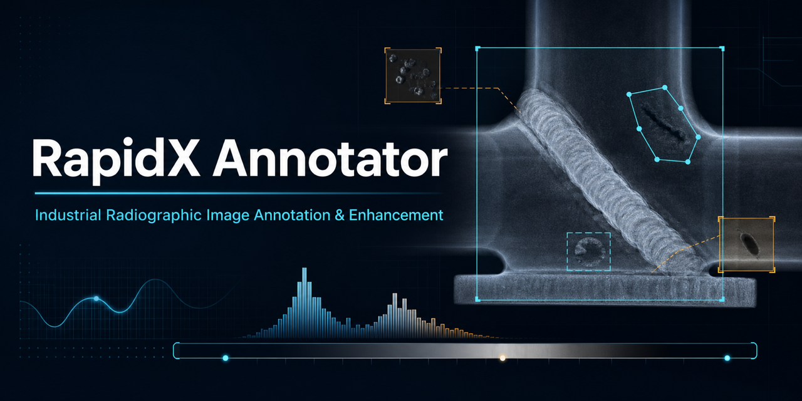

<p align="center">
  
</p>

<p align="center">
  <a href="https://www.python.org/"></a>
  <a href="https://www.qt.io/qt-for-python"></a>
  <a href="https://doi.org/10.1016/j.softx.2025.102328"></a>
  
</p>

<p align="center">
  <strong>RapidX Annotator</strong> is a desktop research tool for inspecting, enhancing, and annotating industrial radiographic images.<br>
  面向工业射线图像的查看、增强与缺陷标注工具。
</p>

<p align="center">
  <a href="https://cqic.bit.edu.cn/kjcx/yjsgk/59d317c8119d4b49974700f9dd24e1cf.htm"><strong>Research Institute / 课题组</strong></a>
  &nbsp;·&nbsp;
  <a href="https://drive.google.com/drive/folders/1LNUt101wufTBJpRAgrZAU1h-Tfx629wO?usp=sharing"><strong>SWRD Dataset / 数据集</strong></a>
  &nbsp;·&nbsp;
  <a href="https://doi.org/10.1016/j.softx.2025.102328"><strong>Software Paper</strong></a>
  &nbsp;·&nbsp;
  <a href="https://doi.org/10.1007/s10921-025-01186-w"><strong>Dataset Paper</strong></a>
</p>

---

## Overview

RapidX Annotator supports a practical human-in-the-loop workflow for non-destructive testing (NDT): open radiographic images, improve defect visibility, create or refine annotations, and save structured labels for downstream analysis and model development.

### Highlights

- **Radiography-focused image viewing** for TIFF, DICOM/DICONDE, PNG, JPEG, and BMP files.
- **Manual annotation tools** for bounding boxes and polygon regions.
- **Standard label output** in Pascal VOC XML and JSON formats.
- **Interactive enhancement** including contrast adjustment, denoising, sharpening, grayscale conversion, pseudo-color rendering, and positive/negative display.
- **Geometric operations and inspection aids** including rotation, flipping, zooming, and local signal-to-noise measurement.
- **Batch prediction integration** for model-assisted pre-annotation and subsequent manual refinement.
- **Custom defect classes, user management, and operation logs** for repeatable annotation workflows.

> [!NOTE]
> The current public source tree contains the batch-prediction interface, but does not include all referenced model implementations or trained weights. Provide the corresponding model modules and weights before enabling AI-assisted pre-annotation.

## Companion SWRD dataset

The **SWRD (Seam Weld Radiographic Dataset)** is a companion resource for weld-defect research. It contains **3,675 original seam-weld X-ray images**, covering standard seam welds and T-joint seam welds. Polygon annotations identify six common defect types—porosity, inclusion, crack, undercut, lack of fusion, and lack of penetration—supporting research in classification, object detection, and instance segmentation.

- **Download:** [SWRD dataset on Google Drive](https://drive.google.com/drive/folders/1LNUt101wufTBJpRAgrZAU1h-Tfx629wO?usp=sharing)
- **Dataset paper:** [SWRD: A Dataset of Radiographic Image of Seam Weld for Defect Detection](https://doi.org/10.1007/s10921-025-01186-w)

Please review the dataset provider's terms and cite the dataset paper when using the data in research.

## Installation

The current codebase targets **Windows** because several modules depend on `pywin32`.

```bash
git clone https://github.com/bit628/RapidX-Annotator.git
cd RapidX-Annotator

python -m venv .venv
.venv\Scripts\activate
python -m pip install --upgrade pip
pip install -r requirements.txt

cd src
python main.py
```

Python 3.8 or newer is recommended. For model-assisted prediction, install the framework and model-specific dependencies required by your local model implementation.

## Typical workflow

1. Define or edit defect categories in the class manager.
2. Open one radiograph or a folder of supported images.
3. Apply display enhancement to make low-contrast indications easier to inspect.
4. Draw or refine rectangular and polygon annotations.
5. Save annotations as XML or JSON alongside the source images or in a selected output directory.
6. Optionally configure a compatible model for batch pre-annotation.

## Repository structure

```text
RapidX-Annotator/
├── demo_data/              # Small radiographic-image examples
├── docs/                   # Architecture figures and project artwork
├── requirements.txt
└── src/
    ├── main.py             # PyQt application entry point
    ├── classes.txt         # Default defect classes
    ├── classes_en2ch.txt   # English-to-Chinese class mapping
    ├── libs/
    │   ├── enhance.py      # Image-enhancement algorithms
    │   ├── predict.py      # Batch prediction integration
    │   ├── label.py        # Annotation save/load workflow
    │   ├── divideimage.py  # Large-image tiling utilities
    │   ├── lab/            # XML/JSON and image I/O
    │   └── view/           # Annotation graphics and scenes
    └── wins/               # Application windows and generated UI code
```

## Architecture

<details>
<summary>View the system architecture and annotation workflow</summary>

### System architecture


### Annotation workflow and deep-learning integration


</details>

## Publications and citation

If RapidX Annotator supports your work, please cite the SoftwareX article:

```bibtex
@article{li2025rapidx,
  title   = {RapidX annotator: A specialized software tool for industrial radiographic image annotation and enhancement},
  author  = {Li, Yan and Qiu, Hao and Wang, Xu and Dong, Na and Yu, Xinghua},
  journal = {SoftwareX},
  volume  = {31},
  pages   = {102328},
  year    = {2025},
  doi     = {10.1016/j.softx.2025.102328}
}
```

For the companion dataset:

```bibtex
@article{zhao2025swrd,
  title   = {SWRD: A Dataset of Radiographic Image of Seam Weld for Defect Detection},
  author  = {Zhao, Xuefeng and Wu, Juntao and Zhang, Baoxin and Wen, Haoyu and Wang, Xiaopeng and Li, Yan and Yu, Xinghua},
  journal = {Journal of Nondestructive Evaluation},
  volume  = {44},
  number  = {2},
  pages   = {50},
  year    = {2025},
  doi     = {10.1007/s10921-025-01186-w}
}
```

## Research group

RapidX Annotator and SWRD are open research outputs from the **Institute of Arc Cognitive Manufacturing, Chongqing Innovation Center, Beijing Institute of Technology**.

- [Institute website / 电弧认知制造技术研究所](https://cqic.bit.edu.cn/kjcx/yjsgk/59d317c8119d4b49974700f9dd24e1cf.htm)
- [Chongqing Innovation Center, Beijing Institute of Technology](https://cqic.bit.edu.cn/)

## License

The repository's `LICENSE.txt` is currently empty. Reuse terms are therefore not yet stated clearly in this public source tree. Please contact the maintainers before redistribution or commercial use, and replace this notice once an approved open-source license has been added.

## Acknowledgements

RapidX Annotator builds on the Python scientific-computing ecosystem, including PyQt, OpenCV, NumPy, SciPy, pydicom, nibabel, and PaddleX.

